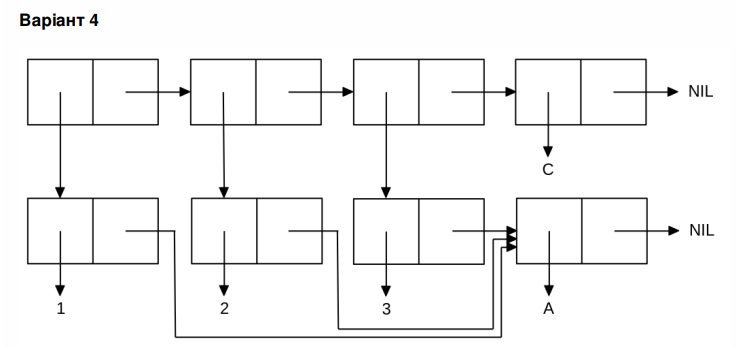

<p align="center"><b>МОНУ НТУУ КПІ ім. Ігоря Сікорського ФПМ СПіСКС</b></p>
<p align="center">
<b>Звіт з лабораторної роботи 1</b><br/>
"Обробка списків з використанням базових функцій"<br/>
дисципліни "Вступ до функціонального програмування"
</p>
<p align="right"><strong>Студент:</strong> <i>Сілін Ілля Денисович КВ-12</i><p>
<p align="right"><strong>Рік:</strong> <i>2024</i><p>
## Загальне завдання
<!--лістинг пунктів загального завдання можна навести в одному блоці коду із коментаряякі позначають початок виконання окремих пунктів, або ж розділити весь лістинг на окреблоки коду і додати для них підзаголовки (напр. ### Пункт 1)-->
```lisp
<тут має бути лістинг (текст) виконання загального завдання>
```
## Варіант <номер варіанту>
<p align="center">

</p>
```lisp
<тут має бути лістинг (текст) виконання завдання за варіантом>
```
# Example headings

## Sample Section

## This'll be a _Helpful_ Section About the Greek Letter Θ!
A heading containing characters not allowed in fragments, UTF-8 characters, two consecutive spaces between the first and second words, and formatting.

## This heading is not unique in the file

TEXT 1

## This heading is not unique in the file

TEXT 2

# Links to the example headings above

Link to the sample section: [Link Text](#sample-section).

Link to the helpful section: [Link Text](#thisll--be-a-helpful-section-about-the-greek-letter-Θ).

Link to the first non-unique section: [Link Text](#this-heading-is-not-unique-in-the-file).

Link to the second non-unique section: [Link Text](#this-heading-is-not-unique-in-the-file-1).
